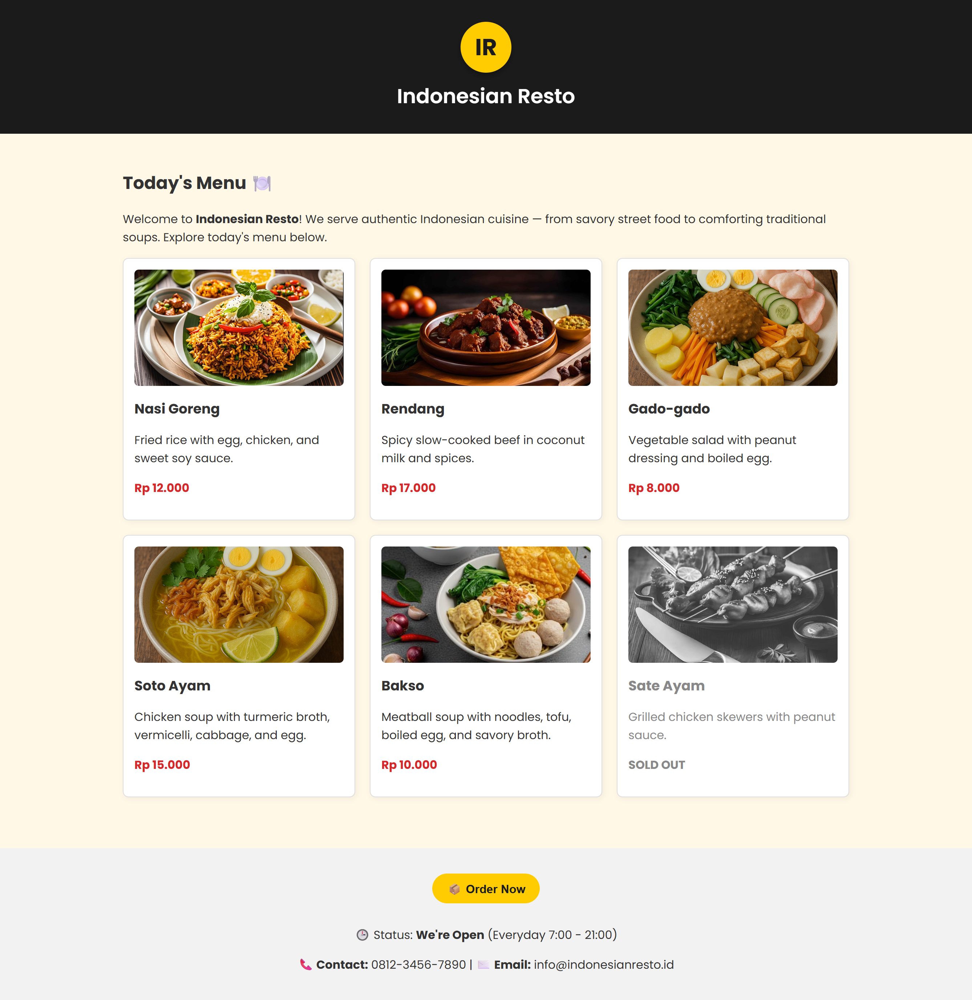

# 🇮🇩 Indonesian Resto

A simple and modern Indonesian restaurant web app built using **React**, **Vite**, **HTML**, and **CSS**. This project showcases a clean UI and key React features such as reusable components, conditional rendering, and JavaScript list rendering using `.map()`.

Live Demo: [View on Vercel](https://indonesian-resto.vercel.app/)

---

## 🚀 Features

- ✅ **Menu Display** – Dynamically renders a list of Indonesian dishes using `.map()`
- 🏷️ **Sold Out Styling** – Special visual style for dishes that are sold out
- 🟢 **Open Status Indicator** – Shows if the restaurant is currently open or closed
- ♻️ **Reusable Components** – Modular component structure (e.g. Header, MenuItem, Footer, etc)
- 🎯 **JSX & Destructuring** – Clean, readable code using object destructuring
- ❓ **Ternary Operators** – Conditional rendering for open/close status and sold out logic
- 💻 **Responsive Design** – Looks great on mobile and desktop
- ⚡ **Built with Vite** – Fast development and build tool
- 🌐 **Deployed on Vercel** – One-click deploy and CI/CD support

---

## 🧑‍💻 Tech Stack

- **React** – UI library
- **Vite** – Development/build tool
- **HTML & CSS** – Markup and styling
- **Vercel** – Deployment

---

## 📂 Project Structure

```bash
indonesian-resto/
├── public/ # Images
├── src/
│   ├── App.css
│   ├── App.jsx
│   └── main.jsx
├── index.html
├── package.json
└── README.md
```

## 📸 Screenshot



> 💡 Tip: Put your `screenshot.png` in the root directory or `public/` and update the path if needed.

---

## 🛠️ How to Run Locally

To run this project on your local machine:

```bash
# 1. Clone the repository
git clone https://github.com/yourusername/indonesian-resto.git
cd indonesian-resto

# 2. Install the dependencies
npm install

# 3. Start the development server
npm run dev
```

📦 Build for Production

```bash
npm run build
```

## 📝 License

This project is open-source and available under the MIT License.
